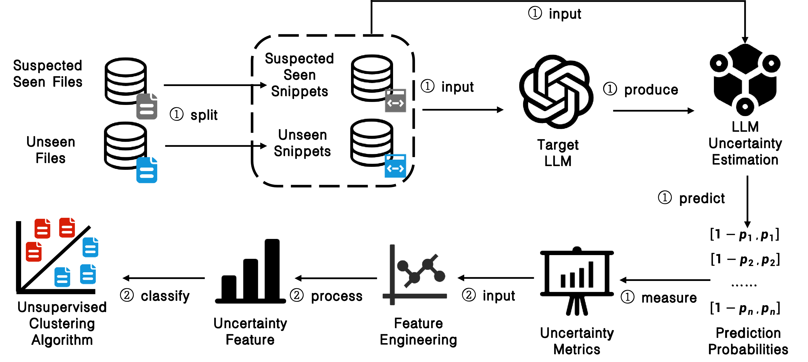

# CopyCheck

## Overview

This repository contains the implementation of **CopyCheck**, the tool proposed in our paper:

> **As If We’ve Met Before: Text-Based LLMs Exhibit Greater Certainty on Seen Files**

Large Language Models (LLMs) are trained on massive collections of data that may include copyrighted or otherwise sensitive materials, making it increasingly important to determine whether a particular file has been used during model training. Existing membership inference attacks (MIAs), however, often rely on labeled membership data, empirically tuned decision thresholds, or token-level confidence signals that can be unreliable due to the overconfidence of LLMs.

**CopyCheck** is an uncertainty-based framework for **file-level membership inference**, aiming to determine which files in a collection of suspected training files have actually been seen by a target LLM.

The key observation behind CopyCheck is that **text snippets extracted from seen files tend to exhibit lower predictive uncertainty than snippets from unseen files**. Based on this observation, CopyCheck follows a two-stage pipeline:

1. **Uncertainty Extraction and File-level Representation**  
   Each file is segmented into multiple text snippets. CopyCheck estimates the model uncertainty for each snippet and aggregates snippet-level uncertainty signals into a file-level representation.

2. **Unsupervised Seen-file Detection**  
   CopyCheck performs uncertainty-guided unsupervised clustering over file-level representations to distinguish seen files from unseen files, avoiding the need for empirically tuned decision thresholds or large-scale labeled membership data.

We evaluate CopyCheck on multiple open-weight LLMs across different model families, model scales, and datasets. The results demonstrate that uncertainty signals provide an effective and generalizable indicator for detecting whether an entire file has appeared in an LLM's training data.

## Framework

The overall workflow of **CopyCheck** is illustrated below.

  

CopyCheck first segments each candidate file into multiple text snippets and estimates uncertainty for each snippet using the target LLM. The snippet-level uncertainty measurements are then aggregated into file-level representations, which are subsequently analyzed using unsupervised clustering to identify seen and unseen files.

## Dependencies:
We develop the codes on Windows operation system, and run the codes on Ubuntu 20.04. The runtime environment for the code is the same as that of [BLoB](https://github.com/Wang-ML-Lab/bayesian-peft). 

## Dataset:
Source data:  [BookMIA](https://huggingface.co/datasets/swj0419/BookMIA).

